# 성적 판정 자동화 비교 구현 : Make와 n8n

> 문서와 캡처의 이름과 점수는 실습용 가상 테스트 데이터입니다. API Key, 토큰, 비밀번호 및 Webhook URL은 포함하지 않았습니다.

# 1. 프로젝트 개요

본 프로젝트는 Google Sheets에 입력된 학생 성적 데이터를 자동으로 판정하고, 결과를 분류 저장한 뒤 Discord 채널로 알림을 전송하는 자동화 워크플로우를 구현한 프로젝트이다.

점수 기준은 60점 이상이면 합격, 60점 미만이면 불합격, 점수가 비어 있거나 확인이 필요한 경우에는 확인필요로 분류하였다.

동일한 자동화 워크플로우를 Make와 n8n 두 가지 자동화 도구로 각각 구현하여, 두 도구의 사용 방식과 장단점을 비교 분석하였다.

## 2. 프로젝트 목적

반복적으로 수행되는 성적 확인, 합격 여부 판정, 결과 정리, 팀 채널 공유 작업을 자동화하여 수작업 시간을 줄이고 입력 실수와 공유 누락을 방지하는 것이 목적이다.

또한 동일한 업무를 서로 다른 자동화 도구로 구현해 보면서 Trigger, Action, 조건 분기 구조의 작동 방식을 이해하고, Make와 n8n의 차이를 비교하는 것을 목표로 하였다.

## 3. 사용한 주요 도구

| 도구 | 사용 목적 | 역할 |
| --- | --- | --- |
| Google Sheets | 성적 데이터 입력 및 결과 저장 | Trigger, 결과 저장소 |
| Make | 자동화 워크플로우 구현 | 첫 번째 자동화 도구 |
| n8n | 자동화 워크플로우 구현 | 두 번째 자동화 도구 |
| Discord | 판정 결과 알림 전송 | 알림 채널 |

## 4. 자동화 워크플로우 구조

본 프로젝트의 자동화 흐름 Google Sheets에 학생 성적 데이터가 입력되는 것을 시작점으로 설정하였다.

이후 입력된 점수를 기준으로 합격, 불합격, 확인필요 중 하나로 판정하고, 해당 결과를 각각의 결과 시트에 저장한 뒤 Discord 채널로 알림을 전송하도록 구성하였다.

전체 흐름은 다음과 같다.

Google Sheets 성적 입력 → 자동화 도구 실행 → 조건 분기 → 결과별 시트 저장 → Discord 알림 전송

| 단계 | 처리 내용 |
| --- | --- |
| 1단계 | Google Sheets에 학생 이름과 점수 입력 |
| 2단계 | 자동화 도구가 새 행이 추가된 것을 감지 |
| 3단계 | 점수 기준에 따라 합격, 불합격, 확인필요 판정 |
| 4단계 | 판정 결과에 따라 해당 시트에 데이터 저장 |
| 5단계 | Discord 채널로 판정 결과 알림 전송 |

 

## 5.  Make 구현 내용

Make에서는 Google Sheets에 새 성적 데이터가 입력되면 자동화가 시작되도록 구성하였다. 이후 Router를 사용하여 점수 조건에 따라 합격, 불합격, 확인필요로 분기하였다. 각 분기에서는 판정 결과를 해당 Google Sheets 결과 시트에 저장하고, Discord 채널로 알림을 전송하도록 설정하였다.

| 구성 요소 | 역할 |
| --- | --- |
| Google Sheets Trigger | 성적입력 시트에 새 행이 추가되는 것을 감지 |
| Router | 점수 조건에 따라 합격, 불합격, 확인필요로 분기 |
| Google Sheets Add a Row | 판정 결과를 각 결과 시트에 저장 |
| Discord | 판정 결과 알림 메시지 전송 |

Make 자동화 흐름은 다음과 같다.

Google Sheets Trigger → Router → 조건별 Google Sheets 저장 → Discord 알림 전송

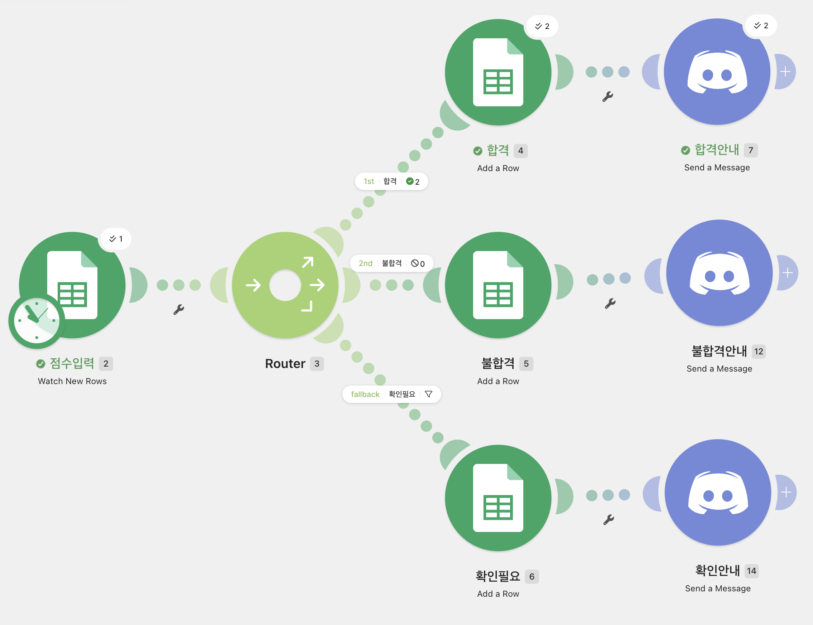

[그림] Make에서 구현한 성적 판정 자동화 워크플로우

Router에서는 점수 값을 기준으로 조건을 나누었다. 점수가 60점 이상이면 합격 경로로 이동하고, 60점 미만이면 불합격 경로로 이동하도록 설정하였다. 점수가 입력되지 않은 경우에는 fallback 경로를 통해 확인필요로 분류되도록 구성하였다.

| 조건 | 처리 결과 |
| --- | --- |
| 점수 ≥ 60  | 합격 시트 저장 + Discord 합격 알림 |
| 점수 < 60  | 불합격 시트 저장 + Discord 불합격 알림 |
| 점수 미입력 | 확인필요 시트 저장 + Discord 확인 알림 |

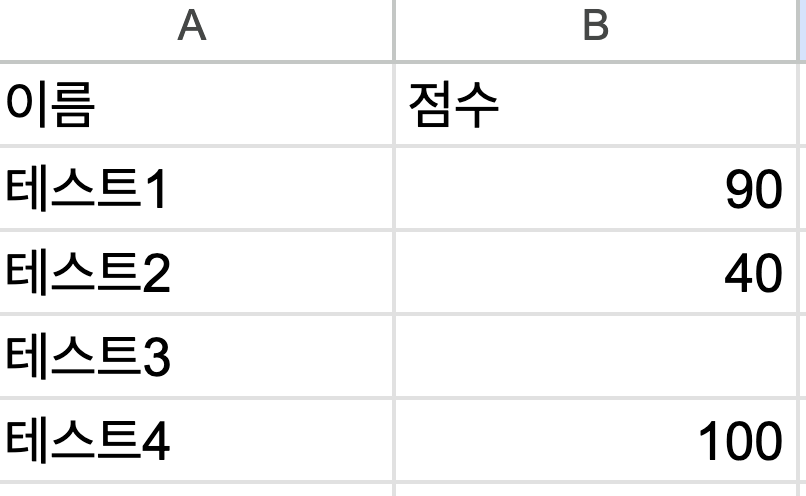

성적입력시트

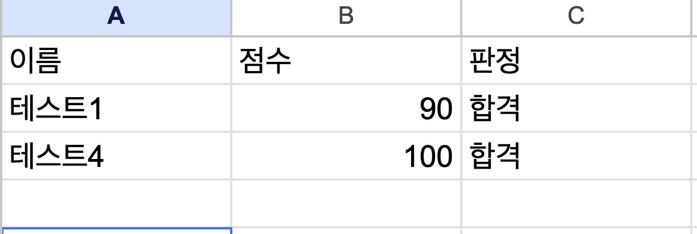

합격시트

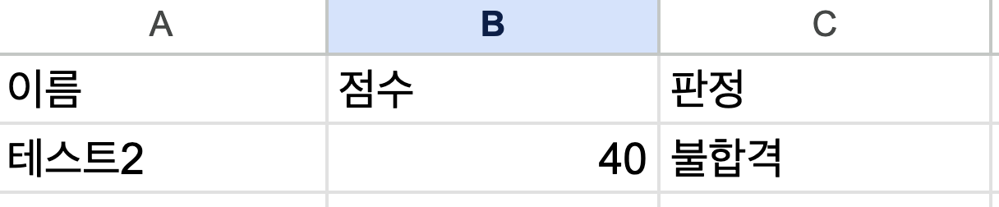

불합격시트

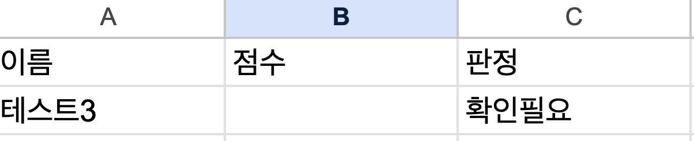

확인필요시트

테스트 데이터로 90점, 40점, 점수 미입력, 100점을 입력하여 실행하였다. 

실행 결과 90점과 100점은 합격 시트에 저장되었고, 40점은 불합격 시트에 저장되었다. 

점수가 입력되지 않은 테스트3은 확인필요 시트에 저장되어 조건 분기가 정상적으로 작동함을 확인하였다.

Google Sheets에 판정 결과가 저장된 후, 각 조건에 맞는 Discord 알림도 정상적으로 전송되었다.

make 실행 결과 discord로 전송된 성적 판정 알림

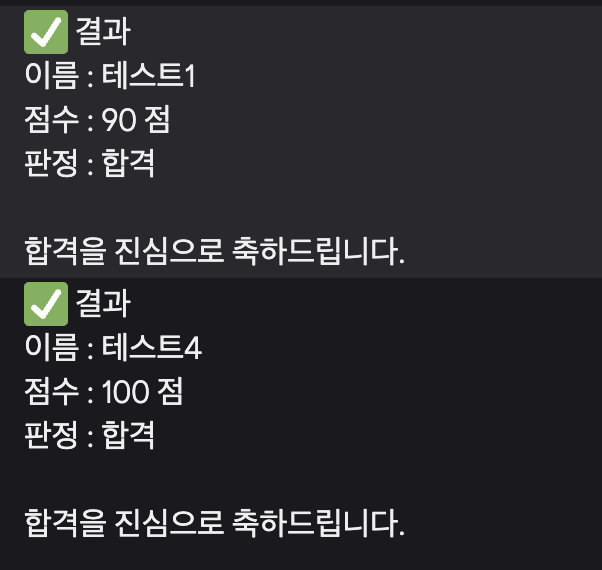

합격 디스코드

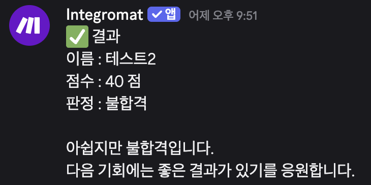

불합격 디스코드


확인필요 디스코드

점수 미입력 데이터의 경우 점수 값은 비어 있지만, 판정 결과가 확인필요로 정상 전송되었다.

## 6. n8n 구현 내용

n8n에서는 Google Sheets Trigger를 시작점으로 하여 입력된 점수를 Code 노드에서 판정한 뒤,

 Switch 노드를 통해 합격, 불합격, 확인필요으로 분기하였다. 

각 분기 결과는 해당 Google Sheets 시트에 저장되고, Discord로 결과 알림이 전송되도록 구성하였다.

```
n8n 자동화 흐름은 다음과 같다.

1. Google Sheets의 성적입력 시트에 새로운 행이 추가된다.
2. Google Sheets Trigger 노드가 새 데이터를 감지한다.
3. Code in JavaScript 노드에서 점수를 기준으로 판정값을 생성한다.
4. Switch 노드가 판정값에 따라 데이터를 3개 경로로 분기한다.
5. 합격 데이터는 합격 시트에 저장된다.
6. 불합격 데이터는 불합격 시트에 저장된다.
7. 점수가 비어 있는 데이터는 확인필요 시트에 저장된다.
8. 각 결과는 Discord 메시지로 알림 전송된다.
```

| 순서 | 노드 이름 | 역할 |
| --- | --- | --- |
| 1 | 점수 구글시트 | 성적입력 시트에 새 행이 추가되면 자동화 실행 |
| 2 | Code in JavaScript | 점수를 기준으로 합격, 불합격, 확인필요 판정 |
| 3 | Switch | 판정값에 따라 3개 경로로 분기 |
| 4 | Pass | 합격 데이터를 합격 시트에 추가 |
| 5 | Fail | 불합격 데이터를 불합격 시트에 추가 |
| 6 | ? | 점수 공백 데이터를 확인필요 시트에 추가 |
| 7 | 합격 | 합격 결과를 Discord로 전송 |
| 8 | 불합격 | 불합격 결과를 Discord로 전송 |
| 9 | 확인필요 | 확인필요 결과를 Discord로 전송 |

```
판정 기준은 다음과 같이 설정하였다.

- 점수가 60점 이상이면 합격
- 점수가 60점 미만이면 불합격
- 점수가 비어 있으면 확인필요

이 기준을 Code in JavaScript 노드에서 처리한 뒤, 결과값을 판정 컬럼으로 생성하였다.
```

| 조건 | 판정 결과 |
| --- | --- |
| 점수 ≥ 60 | 합격 |
| 점수 < 60 | 불합격 |
| 점수 공백 또는 숫자가 아닌 값 | 확인필요 |

### 전체 워크플로우

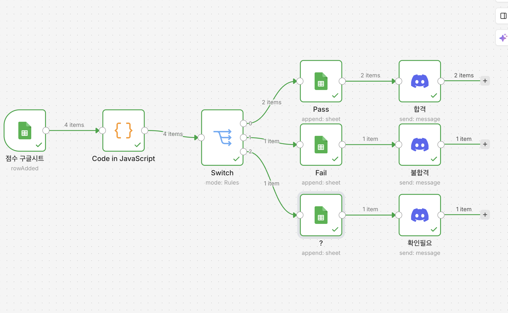

`Google Sheets Trigger로 새 점수 데이터를 감지한 뒤, Code 노드에서 판정 값을 생성하고 Switch 노드로 합격, 불합격, 확인필요 경로를 나누었다. 이후 각 결과는 Google Sheets에 저장되고 Discord로 알림이 전송되도록 구성하였다.`

### Code 노드 구현

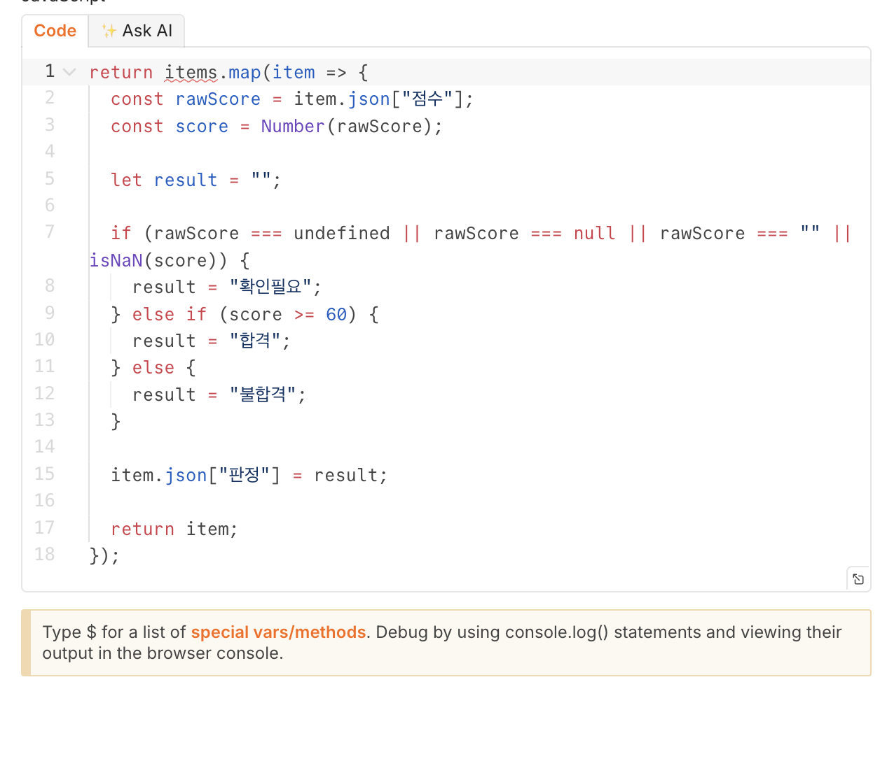

`Code in JavaScript 노드에서는 Google Sheets에서 가져온 점수 데이터를 기준으로 판정 값을 생성하였다. 점수가 비어 있거나 숫자로 변환할 수 없는 경우에는 확인필요로 처리하였고, 점수가 60점 이상이면 합격, 60점 미만이면 불합격으로 처리하였다. 생성된 판정 값은 item.json["판정"]에 저장되어 다음 Switch 노드로 전달된다.`

`이 코드를 통해 입력된 각 학생 데이터에 판정 컬럼을 추가하고, 이후 Switch 노드에서 합격, 불합격, 확인필요로 분기할 수 있도록 하였다.`

| 코드 내용 | 설명 |
| --- | --- |
| rawScore = item.json["점수"] | 구글시트에서 점수 값을 가져옴 |
| score = Number(rawScore) | 점수를 숫자로 변환 |
| rawScore === "” | 점수가 비어 있는지 확인 |
| isNaN(score) | 숫자로 변환할 수 없는 값인지 확인 |
| score >= 60 | 60점 이상이면 합격 처리 |
| item.json["판정"] = result | 판정 결과를 새 컬럼으로 추가 |

### Switch 분기 설정

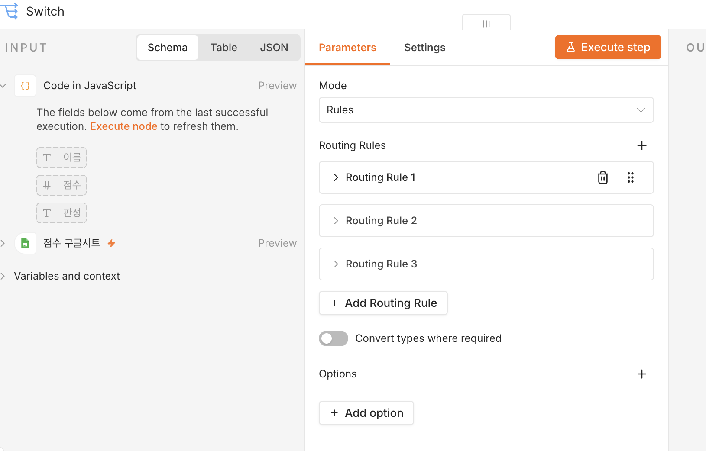

`Switch 노드에서는 Code 노드에서 생성된 판정 값을 기준으로 데이터를 3개의 경로로 분기하였다. 판정 값이 합격이면 합격 저장 경로로, 불합격이면 불합격 저장 경로로, 확인필요이면 확인필요 저장 경로로 이동하도록 설정하였다.`

| 분기 | 조건 | 처리 |
| --- | --- | --- |
| Output 0 | 판정 = 합격 | 합격 시트에 저장 |
| Output 1 | 판정 = 불합격 | 불합격 시트에 저장 |
| Output 2 | 판정 = 확인필요 | 확인필요 시트에 저장 |

### Google Sheets 저장 설정

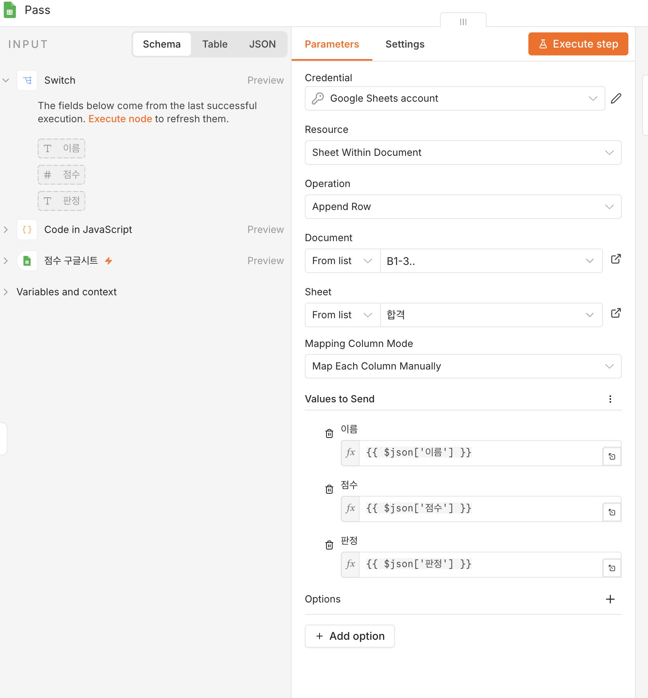

`Switch 노드에서 분기된 데이터는 판정 결과에 따라 각각의 Google Sheets 시트에 Append 방식으로 저장되도록 설정하였다. 합격 데이터는 합격 시트에, 불합격 데이터는 불합격 시트에, 확인필요 데이터는 확인필요 시트에 추가된다.`

| 판정 결과 | 저장시트 |
| --- | --- |
| 합격 | 합격 |
| 불합격 | 불합격 |
| 확인필요 | 확인필요  |

### Discord 알림 설정

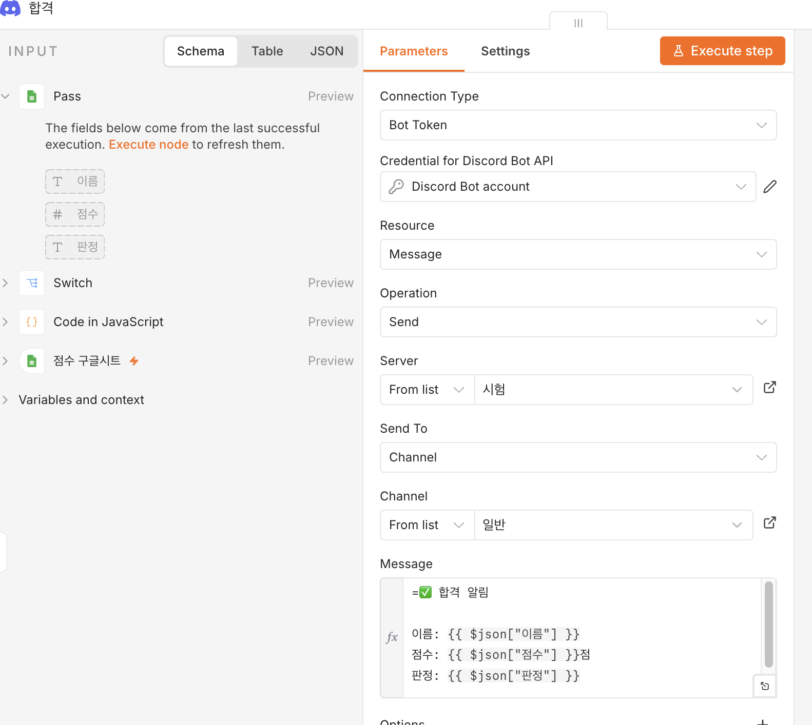

`각 결과가 Google Sheets에 저장된 후 Discord로 알림 메시지가 전송되도록 설정하였다. 이를 통해 사용자는 구글시트를 직접 확인하지 않아도 성적 판정 결과를 바로 확인할 수 있다.`

=✅ 합격 알림

이름: {{ $json["이름"] }}
점수: {{ $json["점수"] }}점
판정: {{ $json["판정"] }}

합격을 진심으로 축하드립니다.

### 테스트 결과

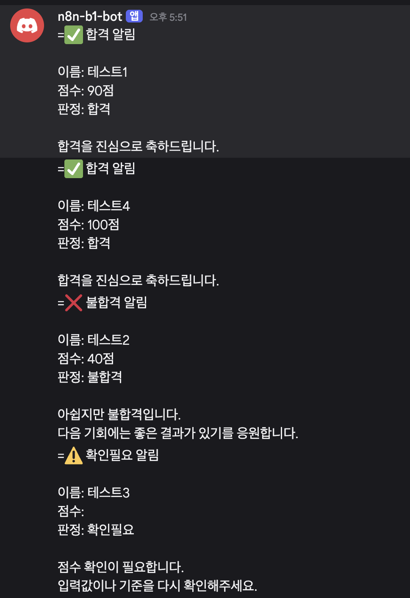

`테스트 실행 결과, 합격, 불합격, 확인필요 판정 결과가 Discord 채널로 정상 전송되었다.`

## Make와 n8n 비교분석

### 1. 공통점

Make와 n8n 모두 Google Sheets에 새 점수 데이터가 입력되면 자동으로 실행되도록 구성하였다. 
두 도구 모두 점수를 기준으로 합격, 불합격, 확인필요를 판정하고, 결과를 각각의 Google Sheets 시트에 저장한 뒤 Discord로 알림을 전송할 수 있었다.

| 공통 기능 | 설명 |
| --- | --- |
| Google Sheets 연동 | 새 점수 데이터 입력 감지 |
| 조건 분기 | 합격, 불합격, 확인필요로 분기 |
| 결과 저장 | 판정 결과를 각 시트에 저장 |
| Discord 알림 | 결과를 Discord 메시지로 전송 |
| 자동화 실행 | 사용자가 직접 분류하지 않아도 자동 처리 |

### 2. 차이점

`Make는 시각적인 모듈 구성이 직관적이어서 자동화 흐름을 이해하기 쉬웠다. 반면 n8n은 Code 노드를 활용하여 직접 JavaScript로 판정 로직을 작성할 수 있어 더 자유로운 처리가 가능했다.`

| 비교 항목 | Make | n8n |
| --- | --- | --- |
| 사용 방식 | 모듈을 연결하여 자동화 구성 | 노드 기반으로 자동화 구성 |
| 조건 처리 | Router와 Filter 사용 | Code 노드와 Switch 노드 사용 |
| 코드 사용 | 거의 필요 없음 | JavaScript 코드 사용 가능 |
| 장점 | 초보자가 이해하기 쉬움 | 복잡한 로직 구현에 유리함 |
| 단점 | 세부 로직 수정에 한계가 있음 | 코드와 노드 구조 이해가 필요함, 유료(2주 무료) |
| 적합한 경우 | 간단하고 빠른 자동화 | 조건이 많거나 복잡한 자동화 |

### 사용하면서 느낀점

```
Make는 화면 구성이 직관적이어서 처음 자동화를 만들 때 이해하기 쉬웠다. Router를 이용해 합격, 불합격, 확인필요 경로를 나누는 방식도 비교적 간단했다.

n8n은 처음에는 Code 노드와 Switch 노드 설정이 조금 어렵게 느껴졌지만, 직접 JavaScript로 판정 기준을 작성할 수 있어서 더 유연하게 자동화를 만들 수 있었다. 특히 점수가 비어 있거나 숫자가 아닌 경우까지 처리할 수 있어 데이터 검증에 유리했다. 
```

### 어떤 도구가 더 적합했는가

```
이번 성적 판정 자동화 프로젝트에서는 Make와 n8n 모두 정상적으로 목표 기능을 구현할 수 있었다.
간단한 자동화만 만든다면 Make가 더 쉽고 빠르다고 느꼈다. 하지만 조건이 많아지거나 직접 데이터를 가공해야 하는 경우에는 n8n이 더 적합하다고 생각했다.

따라서 초보자가 빠르게 자동화를 만들 때는 Make가 적합하고, 더 복잡한 로직을 포함한 자동화를 만들 때는 n8n이 더 적합하다고 판단하였다.
```

### 프로젝트 결과

```
테스트 결과, 입력된 점수 데이터는 판정 기준에 따라 정상적으로 분류되었다.
60점 이상인 데이터는 합격 시트에 저장되었고, 60점 미만인 데이터는 불합격 시트에 저장되었다.
점수가 비어 있는 데이터는 확인필요 시트에 저장되었으며, 각 결과는 Discord 알림으로도 정상 전송되었다.
```

| 테스트 데이터 | 예상 결과 | 실제 결과 |
| --- | --- | --- |
| 85점 | 합격 | 합격 시트 저장 및 Discord 알림 |
| 45점 | 불합격 | 불합격 시트 저장 및 Discord 알림 |
| 공백 | 확인필요 | 확인필요 시트 저장 및 Discord 알림 |

### 결론

```
이번 프로젝트를 통해 Google Sheets, Make, n8n, Discord를 활용하여 성적 판정 자동화를 구현하였다.
기존에는 점수를 확인하고 직접 합격 여부를 분류해야 했지만, 자동화를 적용한 후에는 새 데이터가 입력되면 자동으로 판정, 저장, 알림까지 처리되도록 만들 수 있었다.

Make는 직관적인 자동화 구성에 장점이 있었고, n8n은 코드 기반의 유연한 처리에 장점이 있었다.
이를 통해 같은 문제를 서로 다른 자동화 도구로 해결할 수 있다는 점을 확인할 수 있었다.
```

## **보안 조치**

- API 키, OAuth 토큰, 비밀번호와 Discord Webhook URL을 README 및 이미지에 노출하지 않았습니다.
- Google 및 Discord 자격증명은 로컬 n8n의 Credentials 화면에서 직접 설정합니다.
- 저장소에는 실제 비밀값을 넣지 않고 예시 환경변수 파일만 둡니다.
- 워크플로우를 공유하거나 내보내기 전에 Credential과 테스트 계정 정보가 포함되지 않았는지 확인합니다.
- 로컬 n8n은 외부에 포트를 공개하지 않고 `localhost`에서 사용합니다.
