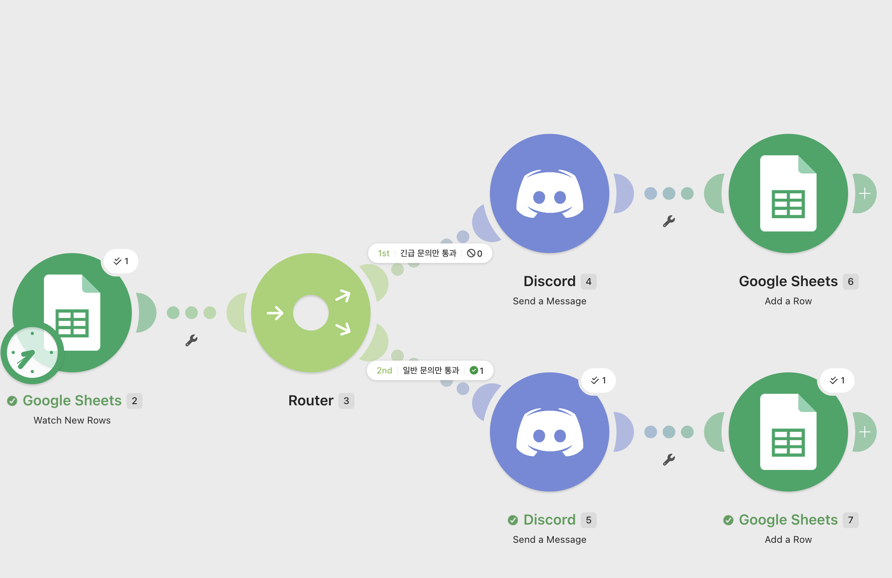
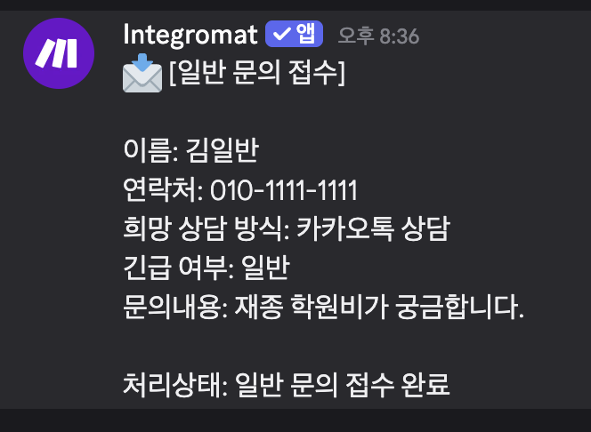
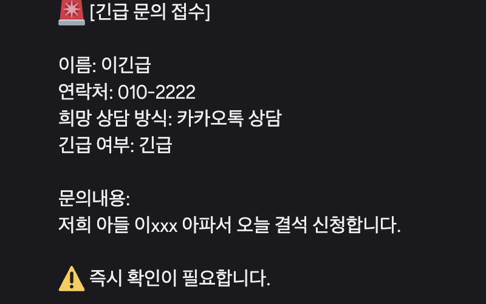

# [프로젝트 2] 자유 주제 자동화 설계 및 구현

> 문서와 캡처의 이름, 연락처 및 문의 내용은 실습용 가상 테스트 데이터입니다. 실제 개인정보와 인증정보는 포함하지 않았습니다.

---

## 1. 프로젝트 주제

### 재수학원 문의 긴급/일반 자동 분류 시스템

재수학원에 들어오는 상담 문의를 Google Forms로 접수한 뒤, 문의의 긴급 여부에 따라 자동으로 분류하고 Discord 알림 및 Google Sheets 기록을 수행하는 자동화 시스템을 구현하였다.

---

## 2. 자동화할 반복 업무 정의

### 자동화 대상 업무

재수학원 상담 문의 접수 및 분류 업무를 자동화하였다.

기존에는 학원 담당자가 상담 신청 내용을 직접 확인한 뒤, 긴급 문의인지 일반 문의인지 판단하고 따로 기록해야 했다. 이 과정은 반복적이고 시간이 소요되며, 긴급 문의를 늦게 확인할 위험이 있다.

따라서 본 프로젝트에서는 문의 접수 시 입력된 `긴급 여부` 값을 기준으로 문의를 자동 분류하고, 담당자가 바로 확인할 수 있도록 Discord로 알림을 보내며, 처리 결과를 Google Sheets에 자동 기록하도록 구성하였다.

---

## 3. 자동화 도구 선정 및 선정 이유

### 선정 도구

```
Make
```

### 선정 이유

Make를 선택한 이유는 다음과 같다.

첫째, Google Sheets, Discord 등 다양한 서비스와 쉽게 연동할 수 있다.

둘째, Router와 Filter 기능을 이용해 조건에 따라 다른 경로로 업무를 분기할 수 있다.

셋째, 코드를 작성하지 않아도 시각적인 방식으로 자동화 흐름을 설계할 수 있어 노코드 자동화 프로젝트에 적합하다.

넷째, 시나리오 실행 결과를 시각적으로 확인할 수 있어 테스트와 오류 확인이 쉽다.

따라서 Make는 상담 문의 자동 분류 및 알림 시스템을 구현하기에 적합한 도구라고 판단하였다.

---

## 4. 워크플로우 설계 문서

## 4-1. 전체 흐름 설명

본 자동화 시스템은 Google Forms로 접수된 상담 문의가 Google Sheets에 저장되면 자동으로 시작된다.

Make의 Google Sheets 모듈이 새 응답 행을 감지하고, Router를 통해 문의의 `긴급 여부` 값을 확인한다.

이후 문의가 `긴급`이면 긴급 문의 경로로 이동하여 Discord에 긴급 알림을 전송하고, 처리 결과를 Google Sheets에 기록한다.

문의가 `일반`이면 일반 문의 경로로 이동하여 Discord에 일반 알림을 전송하고, 처리 결과를 Google Sheets에 기록한다.

---

## 4-2. 워크플로우 다이어그램

```
Google Forms
    ↓
Google Sheets 응답 저장
    ↓
Make - Google Sheets Watch New Rows
    ↓
Router
 ├─ [긴급 여부 = 긴급]
 │      ↓
 │   Discord 긴급 문의 알림 전송
 │      ↓
 │   Google Sheets 처리 결과 기록
 │
 └─ [긴급 여부 = 일반]
        ↓
     Discord 일반 문의 알림 전송
        ↓
     Google Sheets 처리 결과 기록
```

---

## 4-3. 사용한 Trigger와 Action

| 구분 | 사용 모듈 | 역할 |
| --- | --- | --- |
| Trigger | Google Sheets - Watch New Rows | 새로운 상담 문의 접수 감지 |
| 조건 분기 | Router + Filter | 긴급 문의와 일반 문의 분류 |
| Action 1 | Discord - Send a Message | 담당자에게 문의 내용 알림 |
| Action 2 | Google Sheets - Add a Row | 분류 결과 및 처리 상태 기록 |

---

## 5. 조건 분기 설계

## 5-1. 긴급 문의 분기

긴급 문의 분기에서는 Google Forms 응답 중 `긴급 여부` 값이 `긴급`인 경우만 통과하도록 설정하였다.

```
조건: 긴급 여부 = 긴급
```

긴급 문의가 접수되면 Discord에 다음과 같은 형식으로 알림이 전송된다.

```
🚨 [긴급 문의 접수]

이름: 이긴급
연락처: 010-2222
희망 상담 방식: 카카오톡 상담
긴급 여부: 긴급

문의내용:
저희 아들 이xxx 아파서 오늘 결석 신청합니다.

⚠️ 즉시 확인이 필요합니다.
```

이후 Google Sheets의 분류결과 시트에 처리 상태가 기록된다.

```
처리상태: 긴급 알림 완료
```

---

## 5-2. 일반 문의 분기

일반 문의 분기에서는 Google Forms 응답 중 `긴급 여부` 값이 `일반`인 경우만 통과하도록 설정하였다.

```
조건: 긴급 여부 = 일반
```

일반 문의가 접수되면 Discord에 다음과 같은 형식으로 알림이 전송된다.

```
📩 [일반 문의 접수]

이름: 김일반
연락처: 010-1111-1111
희망 상담 방식: 카카오톡 상담
긴급 여부: 일반
문의내용: 재종 학원비가 궁금합니다.

처리상태: 일반 문의 접수 완료
```

이후 Google Sheets의 분류결과 시트에 처리 상태가 기록된다.

```
처리상태: 일반 알림 완료
```

---

## 6. 구현 화면 캡처

### 6-1. Make 전체 워크플로우 구현 화면

아래 화면은 Make에서 구현한 전체 자동화 시나리오이다.

구성은 다음과 같다.

```
Google Sheets Watch New Rows
→ Router
→ 긴급 문의 분기
→ 일반 문의 분기
→ Discord 알림
→ Google Sheets 기록
```



설명 문구:

> Google Sheets에서 새 문의가 접수되면 Router를 통해 긴급 문의와 일반 문의로 분기되고, 각 분기에서 Discord 알림과 Google Sheets 기록 작업이 실행되도록 구성하였다.
> 

---

## 7. 실행 결과 화면 캡처

## 7-1. 일반 문의 실행 결과

일반 문의 테스트 데이터는 다음과 같다.

| 항목 | 내용 |
| --- | --- |
| 이름 | 김일반 |
| 연락처 | 010-1111-1111 |
| 희망 상담 방식 | 카카오톡 상담 |
| 긴급 여부 | 일반 |
| 문의내용 | 재종 학원비가 궁금합니다. |

실행 결과 Discord에 일반 문의 알림이 정상적으로 전송되었다.



설명 문구:

> 긴급 여부가 `일반`인 문의가 접수되었을 때 일반 문의 분기로 이동하여 Discord에 일반 문의 알림이 전송되었다.
> 

---

## 7-2. 긴급 문의 실행 결과

긴급 문의 테스트 데이터는 다음과 같다.

| 항목 | 내용 |
| --- | --- |
| 이름 | 이긴급 |
| 연락처 | 010-2222 |
| 희망 상담 방식 | 카카오톡 상담 |
| 긴급 여부 | 긴급 |
| 문의내용 | 저희 아들 이xxx 아파서 오늘 결석 신청합니다. |

실행 결과 Discord에 긴급 문의 알림이 정상적으로 전송되었다.



설명 문구:

> 긴급 여부가 `긴급`인 문의가 접수되었을 때 긴급 문의 분기로 이동하여 Discord에 긴급 문의 알림이 전송되었다. 메시지에는 즉시 확인이 필요하다는 안내 문구를 포함하였다.
> 

---

## 7-3. Google Sheets 기록 결과

문의가 처리된 후 Google Sheets의 `분류결과` 시트에 문의 정보와 처리 상태가 자동으로 기록되었다.

기록된 항목은 다음과 같다.

| 접수시간 | 이름 | 연락처 | 희망상담방식 | 긴급여부 | 문의내용 | 처리상태 |
| --- | --- | --- | --- | --- | --- | --- |
| 2026. 8. 31 오후 | 김일반 | 010-1111-1111 | 카카오톡 상담 | 일반 | 재종 학원비가 궁금합니다. | 일반 알림 완료 |


설명 문구:

> 일반 문의가 접수된 후 Google Sheets 분류결과 시트에 자동으로 문의 정보와 처리상태가 기록되었다.
> 

---

## 8. 기능 요구 사항 충족 여부

| 요구 사항 | 충족 여부 | 구현 내용 |
| --- | --- | --- |
| 실제로 동작하는 자동화 워크플로우 구현 | 충족 | Google Forms 응답이 Google Sheets에 저장되면 Make 시나리오가 실행됨 |
| Trigger 1개 이상 포함 | 충족 | Google Sheets - Watch New Rows |
| Action 2개 이상 포함 | 충족 | Discord Send a Message, Google Sheets Add a Row |
| 조건 분기 1개 이상 포함 | 충족 | Router와 Filter를 사용하여 긴급/일반 분기 구현 |
| 각 분기 경로 1회 이상 실행 | 충족 | 긴급 문의와 일반 문의 각각 Discord 알림 결과 확인 |
| 자동화할 반복 업무 정의 | 충족 | 상담 문의 접수 및 긴급/일반 분류 업무 정의 |
| 도구 1개 선정 및 이유 작성 | 충족 | Make 선정 및 이유 작성 |
| 자동 실행 구조 구현 | 충족 | Google Sheets Watch New Rows 기반 자동 실행 |
| 워크플로우 흐름 설명 포함 | 충족 | 전체 흐름 및 다이어그램 작성 |

---

## 9. 최종 정리

본 프로젝트에서는 재수학원 상담 문의 접수 업무를 자동화하였다.

Google Forms로 문의가 접수되면 Google Sheets에 저장되고, Make가 새 응답을 감지하여 자동으로 시나리오를 실행한다.

문의의 긴급 여부에 따라 Router가 긴급 문의와 일반 문의를 분류하고, 각 분기에서 Discord 알림을 전송한 뒤 Google Sheets에 처리 결과를 기록한다.

이를 통해 담당자는 긴급 문의를 빠르게 확인할 수 있으며, 일반 문의도 누락 없이 기록할 수 있다.

반복적인 문의 확인 및 분류 작업을 줄이고, 상담 업무의 효율성을 높일 수 있었다.

---
